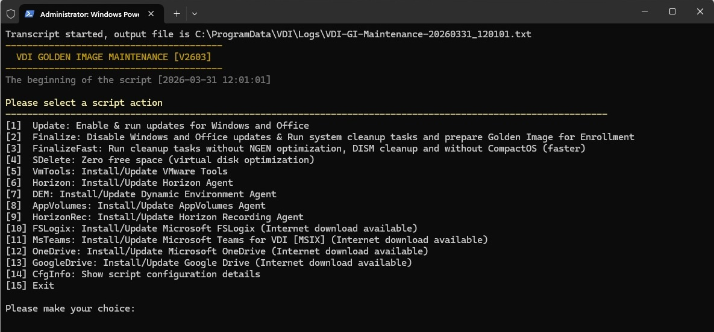

# VDI Golden Image Maintenance

A robust, programmable maintenance script designed for managing VDI Golden Images (Master PCs) running Omnissa (VMware) Horizon.

This script provides a centralized toolkit for managing the entire lifecycle of your Golden Image. It handles typical maintenance tasks, such as updating the OS and installed software, installing or updating various VDI agents, and finalizing/cleaning up the image before taking the final snapshot for deployment.

## Key Features

**Golden Image Lifecycle Maintenance**

* **Updates Management:** Easily enable/disable and run Windows, Microsoft Office, and web browser updates to ensure proper operation in Instant Clone virtual desktops.

* **Image Finalization & Cleanup:** Automates the cleanup process using the Omnissa Windows OS Optimization Tool (OSOT) to perform native system cleanup jobs (such as Ngen optimization, NTFS compression, and DISM cleanup), clear KMS settings, release IP addresses, and delete unnecessary files. Additionally, the script provides standalone options to zero out free disk space (using Sysinternals SDelete) and defragment the system drive to reduce the virtual disk size.

**Agent Installation & Updates**

Automatically detects installed versions, downloads the latest installers from the web (or uses local source files), and performs silent installations for:

* Hypervisor tools (VMware Tools)

* Omnissa Horizon Agent, Dynamic Environment Manager (DEM), and App Volumes

* Horizon Recording Agent

* Microsoft FSLogix Apps

* Microsoft Teams for VDI (New Teams MSIX)

* Microsoft OneDrive & Google Drive

## Prerequisites

* **PowerShell:** Run as Administrator.

* **OSOT:** The Omnissa Windows OS Optimization Tool must be present on the system (default path: `C:\Program Files\OSOT`).

* **Internet Connection:** Required if you want the script to automatically download the latest agent installers.

## Installation & Update

You can easily install or update to the latest version of the script directly from the **PowerShell Gallery**:


```
# Install the script for the first time
Install-Script -Name VDI-GoldenImage

# Update an already installed script
Update-Script -Name VDI-GoldenImage
```

*Alternatively, you can manually download the `.ps1` file directly from this repository.*

### Recommended Setup

It is recommended to place the script, its configuration file (`.config`), and the `Install` directory (for offline packages) into a dedicated, machine-wide folder such as:
`C:\ProgramData\VDI`

## Usage

You can run the script interactively or fully automated via command-line parameters.

### 1. Interactive Menu (Default)

If you run the script without any parameters, it will display an interactive, user-friendly menu listing all available actions.

```
.\VDI-GoldenImage.ps1
```



### 2. Automated Execution (Via Parameters)

You can bypass the menu by specifying the exact task using the `-Action` parameter.

**Enable and run OS/Office/Software updates:**

```
.\VDI-GoldenImage.ps1 -Action Update
```

**Finalize and clean up the Golden Image before taking a snapshot:**

```
.\VDI-GoldenImage.ps1 -Action Finalize
```

**Install or update Microsoft Teams for VDI:**

```
.\VDI-GoldenImage.ps1 -Action MsTeams
```

## Configuration

The script uses a default set of variables defined internally within the `$VAR` hash table. You can easily override these settings without modifying the main script file by using a configuration file. **This makes future updates of the script much easier**, as your custom settings remain preserved when you replace the main `.ps1` file with a newer version.

Create a file named `VDI-GoldenImage.ps1.config` in the same directory as the script. The script will automatically detect and load it.

**Example `VDI-GoldenImage.ps1.config`:**

```
DemConfigPath = "\\domain.int\VDI$\DEMConfig\general"
HorizonAgentExecScriptTimeout = 60000
ManageOfficeUpdates = $false
ManageGoogleUpdates = $false
OsotShutdownAfterFinalize = $true
```

*Alternatively, you can specify a custom config file path using the `-ConfigFile` parameter.*

## License

This project is licensed under the [MIT License](https://mit-license.org/).
